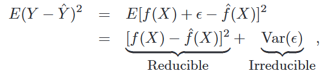

### Statistical Learning

- $Y = f(X) + e$; where $e$ -> Irreducible error with variance $\sigma^2$ and mean 0.
- Function estimate will have irreducible and reducible error.
- Causes
    - Y is also a function of $e$, (Data can inherently have its own error)
    - $e$ may contain unmeasureable variation due to variables that aren't taken into account.
    

- More flexible methods have higher variance. Variance in a way represents sensitivity of estimator to change in data.

- Why $n-k-1$ degrees of freedom for $\beta_0, \dots, \beta_k$ parameters?

    We obtain values of $\beta$ from minimising the MSE. We can write the MSE as $M(\beta_0, \dots, \beta_k).$
    We get $k+1$ equations by applying $\frac{\partial M}{\partial\beta_i} = 0.$ This gives us $k+1$ less degrees of freedom for values $x_1, x_2, \dots, x_n.$

### Regression
**Linear Regression**
- We get formula for $\hat{\beta}$ matrix by differentiating RSS wrt to $\beta_i$. $$ \hat{\beta} = (X^T X)^{-1} X^T y. $$
- $\text{Var}(\hat{\beta}) = (X^T X)^{-1} \sigma^2.$ This is the Var-Covar matrix which gives $$\text{Var}(\hat{β}) = \begin{bmatrix} \text{Var}(β_0) & \text{Cov}(β_0,β_1) \\ \text{Cov}(β_0,β_1) & \text{Var}(β_1) \end{bmatrix}.$$

- What exactly is $\hat{\sigma}$ measuring? $$\hat{\sigma}^2 = \frac1{N-p-1} \sum (y_i - \hat{y_1})^2.$$
    The $N-p-1$ is what makes it an unbiased estimator of $\sigma^2$.

**Lasso**
- Just add $\sum | \beta_i |$ to the error function, $R$.
- Regression $$ \frac{\partial R}{\partial \beta_i} = \sum x_i (\hat{y} - y_i) +  \lambda \sum 2 \beta_i.$$